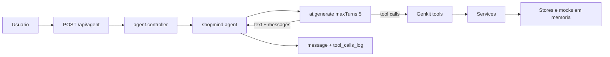

# ShopMind

Agente de compras do desafio **Kobe — Shopping Agent**. Você manda texto em português; a API chama o Gemini via **Genkit**, deixa o modelo escolher **function calling**, e devolve a resposta falada + um **`tool_calls_log`** com tudo que foi executado naquele turno. O objetivo é mostrar orquestração e guardrails — não um e-commerce com banco e checkout de verdade.

---

## Stack

- **Node.js** 24 (`>=24 <25` — projeto fixado no 24, vê `.nvmrc` e `package.json`)
- **TypeScript** ESM
- **Express** 5
- **React** 19 + **Vite** 7 (UI em [`client/`](client/))
- **Genkit** + **@genkit-ai/google-genai** (Gemini; default `gemini-2.5-flash` no `.env.example`)
- **Zod** na API e nas tools
- **dotenv**, **pnpm**, **tsx** no dev

---

## O que você precisa antes

1. **Node 24** instalado (ex.: `nvm use 24` — `node --version` deve ser `v24.x`). Com Node 25+ o pnpm avisa `Unsupported engine`.
2. **pnpm** — o repo tem `pnpm-lock.yaml`; o fluxo suportado é com pnpm. Um checklist externo pode citar `npm install`, mas aqui o setup reproduzível é **`pnpm install`**.
3. **`GEMINI_API_KEY`** da Google.

---

## Como instalar

```sh
cd shopmind
nvm use 24
pnpm install
cp .env.example .env
```

Abre o `.env` e coloca a chave.

---

## Variáveis do `.env`

| Variável         | Função                                   |
| ---------------- | ---------------------------------------- |
| `PORT`           | Porta (default `3000`)                   |
| `NODE_ENV`       | `development` / `production`             |
| `GEMINI_API_KEY` | Chave da API — **necessária** pro agente |
| `GENKIT_MODEL`   | Modelo Gemini (ex.: `gemini-2.5-flash`)  |

Arquivo de referência: [`.env.example`](.env.example).

---

## Como rodar

**API + UI (desenvolvimento)** — dois processos: Express na porta `PORT` (default `3000`) e **Vite** em `5173` (override com `VITE_DEV_PORT`). O navegador abre **`http://localhost:5173`**: chamadas para `/api` são encaminhadas ao backend (mesmo valor de `PORT` do `.env` na raiz).

```sh
pnpm dev
```

Só a API (sem React):

```sh
pnpm dev:api
```

Só o Vite (precisa da API em outro terminal):

```sh
pnpm dev:web
```

Build + produção local (um único origin: API serve o `client/dist` em `/`):

```sh
pnpm check    # typecheck API + client, opcional
pnpm build
pnpm start
```

Saída esperada: algo como `ShopMind API listening on http://localhost:3000` e, se existir build do client, `ShopMind UI available at http://localhost:3000/`.

Scripts:

- **`pnpm dev`** — API + Vite em paralelo (`concurrently`)
- **`pnpm dev:api`** — `tsx watch`, só o Express
- **`pnpm dev:web`** — Vite no pacote `client/`
- **`pnpm check`** — TypeScript da API e do client (sem emitir)
- **`pnpm build`** — `build:web` (Vite → `client/dist`) e em seguida `build:api` (`dist/` do servidor)
- **`pnpm start`** — `node dist/server.js`

**Sessão no chat:** o React grava `session_id` em `localStorage` e reutiliza em todo `POST /api/agent`. O histórico que o modelo vê fica no **servidor** por essa sessão — recarregar a página mantém o mesmo id e o contexto (ex.: confirmação de pedido). **Nova sessão** gera outro id e zera só a lista local; carrinho/pedidos no mock seguem o id antigo no servidor.

Teste rápido:

```sh
curl -s http://localhost:3000/health
```

---

## Como isso se encaixa (fluxo alto nível)

Tu posta `message` + `session_id`. O Express valida → `runShopMindAgent` monta o histórico da sessão → **Genkit** roda `ai.generate` com tools e **`maxTurns: 5`**. Cada “volta” pode ser uma ou mais tools; o modelo usa o retorno pra decidir o próximo passo. As tools chamam **services**; services leem/gravam **stores em memória** e **mocks** de catálogo/pedido.



---

## API

### `GET /health`

Confirma que o processo subiu.

```json
{
  "status": "ok",
  "service": "shopmind",
  "environment": "development"
}
```

### `POST /api/agent`

**Body (JSON):**

```json
{
  "message": "Quero comprar um tênis de corrida até R$ 400",
  "session_id": "abc-123"
}
```

`message` e `session_id` são obrigatórios, strings não vazias. Se faltar algo, **400** com `status: "error"` e `message` tipo `message and session_id are required`, `message is required`, etc.

**Sucesso (200):**

```json
{
  "message": "Encontrei algumas opções...",
  "tool_calls_log": [
    {
      "tool": "buscar_catalogo",
      "args": {
        "query": "tênis de corrida",
        "max_price": 400,
        "session_id": "abc-123"
      },
      "result": [
        {
          "id": "tenis-runner-pro",
          "name": "Tênis Runner Pro",
          "price": 349.9,
          "stock": 8,
          "shortDescription": "..."
        }
      ]
    }
  ],
  "tool_calls_count": 1
}
```

**Pitfall útil:** sem `GEMINI_API_KEY`, erro de rede ou falha do modelo, o handler às vezes ainda responde **200** com mensagem genérica, **`tool_calls_log` vazio** e `tool_calls_count: 0`. Pra saber se o turno “funcionou de verdade”, confere se o log tem as tools esperadas.

---

## Tools (lista completa)

| Tool                    | O que faz                                                                                    |
| ----------------------- | -------------------------------------------------------------------------------------------- |
| `buscar_catalogo`       | Busca por texto; opcional `category` e `max_price`. Atualiza `lastCatalogResults` da sessão. |
| `resolver_referencia`   | Resolve “primeiro”, “segundo item” pela posição 1-based na última busca.                     |
| `ver_produto`           | Detalhes completos (specs, reviews, estoque por SKU, prazo).                                 |
| `verificar_carrinho`    | Itens + totais; marca estado de fluxo de checkout na sessão.                                 |
| `adicionar_ao_carrinho` | Adiciona com validação de estoque.                                                           |
| `fechar_pedido`         | Mock de fechamento; **só** se o código liberou checkout após confirmação explícita.          |
| `consultar_pedido`      | Status e histórico de pedidos mock (ex.: `PED-2891`).                                        |

Implementação em [`src/ai/tools/`](src/ai/tools/).

---

## Loop de function calling

Um request HTTP pode disparar até **cinco rodadas** de tool calling (`maxTurns: 5` no [`src/agent/shopmind.agent.ts`](src/agent/shopmind.agent.ts)). Exemplo típico de fluxo encadeado: `resolver_referencia` → `ver_produto` → `adicionar_ao_carrinho`, tudo no mesmo `tool_calls_log`.

Se o limite estourar ou der erro de iteração, vem mensagem pedindo pra reformular; o log pode ser **truncado** pra no máximo 5 entradas.

---

## `tool_calls_log`

Cada item traz **`tool`**, **`args`** e **`result`**. Serve pra auditar o que foi executado **sem vazar raciocínio interno** do modelo — só requests/responses de ferramenta. Como o texto natural varia entre runs, o log é o melhor artefato pra avaliar comportamento.

---

## Estado por `session_id`

Tudo é keyed por string opaca. Ver [`src/stores/session.store.ts`](src/stores/session.store.ts):

- **`messages`** — histórico curto pra contexto na próxima rodada do modelo
- **`lastCatalogResults`** — última lista de busca (referências posicionais)
- **`pendingCheckoutConfirmation`** — fluxo “vi o carrinho, falta confirmar?”
- **`checkoutAllowed`** — liberado só quando [`isExplicitConfirmation`](src/utils/confirmation.ts) bate na mensagem do usuário **e** já havia confirmação pendente; caso contrário [`fechar_pedido`](src/ai/tools/checkout.tool.ts) barra

Não há login: quem envia o `session_id` “é dono” daquele estado em memória.

---

## Guardrail de checkout (duas camadas)

1. **Prompt** — [`src/agent/system-prompt.ts`](src/agent/system-prompt.ts): antes de fechar, `verificar_carrinho`, resumo, só então pedir confirmação explícita; “ok” e “beleza” não contam.

2. **Código** — [`verificar_carrinho`](src/ai/tools/get-cart.tool.ts) ajusta `pendingCheckoutConfirmation`. No começo de cada turno o agente só liga **`checkoutAllowed`** se a nova mensagem passar **`isExplicitConfirmation`** (tem que conter algo como **`confirmo`**, **`pode fechar`** ou **`pode finalizar`**, sem cheiro de negação tipo “não”) **e** a sessão estiver em modo de espera de checkout. **`fechar_pedido`** verifica `checkoutAllowed`; senão erro controlado (`CHECKOUT_BLOCKED`).

Ou seja: mesmo o modelo alucinando `fechar_pedido`, o servidor pode travar na camada certa.

---

## Como testar (4 cenários do desafio)

Define a base (troca porta se mudou `PORT`):

```sh
BASE=http://localhost:3000
```

Precisa ter **`jq`** só se quiser formatar JSON; pode tirar o `| jq`.

### 1) Busca simples

Texto típico: _“Quero comprar um tênis de corrida até R$ 400”_  
Esperado no log: em geral **só** `buscar_catalogo`.

```sh
curl -s -X POST "$BASE/api/agent" \
  -H "Content-Type: application/json" \
  -d '{"message":"Quero comprar um tênis de corrida até R$ 400","session_id":"cen1-busca"}' | jq
```

### 2) Fluxo encadeado

Primeiro popula resultados na mesma sessão; depois pede detalhe + carrinho.

```sh
curl -s -X POST "$BASE/api/agent" \
  -H "Content-Type: application/json" \
  -d '{"message":"Quero um tênis de corrida até 600 reais","session_id":"cen2-chain"}' | jq

curl -s -X POST "$BASE/api/agent" \
  -H "Content-Type: application/json" \
  -d '{"message":"Me mostra mais detalhes do segundo item e, se estiver disponível, já coloca no meu carrinho","session_id":"cen2-chain"}' | jq
```

Ordem esperada na prática: `resolver_referencia` → `ver_produto` → `adicionar_ao_carrinho` (se tiver estoque).

### 3) Checkout só depois de confirmar

Carrinho precisa ter itens (usa o cenário 2 antes ou monta seus próprios passos).

Turno A — “Fecha o pedido pra mim”: espera **`verificar_carrinho`**, sem fechar.

```sh
curl -s -X POST "$BASE/api/agent" \
  -H "Content-Type: application/json" \
  -d '{"message":"Fecha o pedido pra mim","session_id":"cen3-checkout"}' | jq
```

Turno B — confirmação explícita: espera **`fechar_pedido`**.

```sh
curl -s -X POST "$BASE/api/agent" \
  -H "Content-Type: application/json" \
  -d '{"message":"Sim, confirmo","session_id":"cen3-checkout"}' | jq
```

### 4) Consulta de pedido

Pedido **`PED-2891`** existe no mock [`src/mocks/orders.mock.ts`](src/mocks/orders.mock.ts).

```sh
curl -s -X POST "$BASE/api/agent" \
  -H "Content-Type: application/json" \
  -d '{"message":"Cadê meu pedido #PED-2891?","session_id":"cen4-pedido"}' | jq
```

Esperado: `consultar_pedido` no log.

---

## Decisões técnicas

- **Dados mockados em memória** — o desafio mede orquestração do agente, não persistência.
- **`session_id`** — amarra carrinho, última busca, flags de checkout e histórico curto.
- **Services separados das tools** — tools são adaptadores pro LLM; regras ficam em [`src/services/`](src/services/).
- **Guardrail duplo no checkout** — regra no prompt + flag na sessão + checagem em `fechar_pedido`.
- **`tool_calls_log` só operacional** — ferramentas, args e resultados; nada de chain-of-thought.
- **`resolver_referencia`** — tool dedicada pra “Nº item da lista” em cima de `lastCatalogResults`, em vez de confiar só no modelo lembrar qual era o produto.

---

## Assunções

- Cliente bem-comportado com `session_id` (sem auth).
- Uma instância do servidor; estado só em RAM.
- Ambiente com chave válida e acesso à API do Gemini pra testes reais.

---

## Limitações

- Restart apaga sessões/carrinho (exceto mocks estáticos de catálogo e pedidos já seedados).
- Respostas em linguagem natural **não** são determinísticas — valida pelo `tool_calls_log`.
- Máximo de **cinco** voltas de tool por request.
- Um processo, sem garantias forte de concorrência.

---

Qualquer dúvida pra depurar: olha primeiro **`.env`** e o **`tool_calls_log`** do último `curl`.
