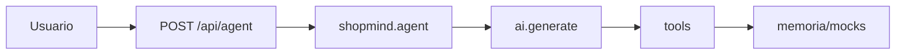

# ShopMind

Agente de compras — desafio **Kobe — Shopping Agent**.

## Stack

| Camada | Escolha |
| --- | --- |
| Runtime | Node **24** (`>=24 <25`, `.nvmrc`) |
| API | TypeScript ESM, **Express** 5 |
| UI | **React** 19 + **Vite** 7 (`client/`) |
| LLM | **Genkit** + `@genkit-ai/google-genai` (Gemini; default `gemini-2.5-flash` em `.env.example`) |
| Validação | **Zod** |
| Pacotes | **pnpm**, **tsx**, **dotenv** |

## Setup

```sh
nvm use 24
pnpm install
cp .env.example .env   # preencher GEMINI_API_KEY
```

`.env`: `PORT`, `NODE_ENV`, `GEMINI_API_KEY` (obrigatória), `GENKIT_MODEL`. Ver [`.env.example`](.env.example).

## Rodar

| Comando | Efeito |
| --- | --- |
| `pnpm dev` | API (`PORT`, default 3000) + Vite (5173); UI em `http://localhost:5173`, `/api` → backend |
| `pnpm dev:api` | Só Express |
| `pnpm dev:web` | Só Vite (API em outro terminal) |
| `pnpm check` | Typecheck API + client |
| `pnpm build` + `pnpm start` | Build único: API serve `client/dist` em `/` |

Chat: `session_id` no `localStorage`; histórico do modelo no servidor por sessão.

Health: `curl -s http://localhost:3000/health`

## Fluxo (resumo)

`POST /api/agent` → validação → `runShopMindAgent` → Genkit `ai.generate` com tools e **`maxTurns: 5`** → tools → services → stores/mocks em memória → resposta com texto + `tool_calls_log`.



## API

- **`GET /health`** — processo vivo.
- **`POST /api/agent`** — body `{ "message": string, "session_id": string }` (ambos obrigatórios, não vazios). Erros **400** com `status: "error"`.
- Sucesso **200**: `message`, `tool_calls_log` (tool + args + result), `tool_calls_count`.
- **Atenção:** falha de modelo/rede ou falta de `GEMINI_API_KEY` pode vir **200** com mensagem genérica e **`tool_calls_log` vazio** — auditar pelo log.

## Tools

| Tool | Função |
| --- | --- |
| `buscar_catalogo` | Busca; opcional `category`, `max_price`; atualiza `lastCatalogResults` |
| `resolver_referencia` | “Primeiro/segundo item” (1-based) na última busca |
| `ver_produto` | Detalhes (specs, reviews, SKU, prazo) |
| `verificar_carrinho` | Carrinho + totais; estado de checkout na sessão |
| `adicionar_ao_carrinho` | Com validação de estoque |
| `fechar_pedido` | Mock; só se checkout liberado após confirmação explícita |
| `consultar_pedido` | Pedidos mock (ex. `PED-2891`) |

Código: [`src/ai/tools/`](src/ai/tools/).

## Comportamento relevante

- **Function calling:** até **5** rodadas por request; log pode truncar a **5** entradas.
- **Estado por `session_id`** ([`session.store`](src/stores/session.store.ts)): `messages`, `lastCatalogResults`, `pendingCheckoutConfirmation`, `checkoutAllowed`. Sem login — quem manda o id “é dono” na memória do processo.
- **Checkout:** (1) prompt em [`system-prompt.ts`](src/agent/system-prompt.ts); (2) `verificar_carrinho` + [`isExplicitConfirmation`](src/utils/confirmation.ts) (ex.: “confirmo”, “pode fechar/finalizar”, sem negação); (3) [`fechar_pedido`](src/ai/tools/checkout.tool.ts) checa `checkoutAllowed`, senão `CHECKOUT_BLOCKED`.
- **`tool_calls_log`:** só execução de ferramentas (args/result), sem chain-of-thought.

## Testes rápidos (curl)

`BASE=http://localhost:3000` (ajustar `PORT`).

```sh
# 1) Busca
curl -s -X POST "$BASE/api/agent" -H "Content-Type: application/json" \
  -d '{"message":"Quero comprar um tênis de corrida até R$ 400","session_id":"t1"}'

# 2) Encadeado (mesma sessão): depois pedir detalhe do 2º item + carrinho
curl -s -X POST "$BASE/api/agent" -H "Content-Type: application/json" \
  -d '{"message":"Quero um tênis de corrida até 600 reais","session_id":"t2"}'
curl -s -X POST "$BASE/api/agent" -H "Content-Type: application/json" \
  -d '{"message":"Me mostra mais detalhes do segundo item e, se estiver disponível, já coloca no meu carrinho","session_id":"t2"}'

# 3) Checkout: primeiro pedir fechar (espera carrinho); depois confirmação explícita
curl -s -X POST "$BASE/api/agent" -H "Content-Type: application/json" \
  -d '{"message":"Fecha o pedido pra mim","session_id":"t3"}'
curl -s -X POST "$BASE/api/agent" -H "Content-Type: application/json" \
  -d '{"message":"Sim, confirmo","session_id":"t3"}'

# 4) Pedido mock PED-2891 — src/mocks/orders.mock.ts
curl -s -X POST "$BASE/api/agent" -H "Content-Type: application/json" \
  -d '{"message":"Cadê meu pedido #PED-2891?","session_id":"t4"}'
```

## Decisões técnicas

- Dados **mock em memória** — foco em orquestração do agente, não persistência.
- **`session_id`** — carrinho, última busca, flags de checkout, histórico curto.
- **Services** separados das tools — tools como adaptadores ao LLM; regras em [`src/services/`](src/services/).
- **Checkout em duas camadas** — prompt + flags na sessão + bloqueio em `fechar_pedido`.
- **`tool_calls_log` operacional** — sem raciocínio interno do modelo.
- **`resolver_referencia`** — referências posicionais sobre `lastCatalogResults`, não só memória do modelo.

## Limitações

- Restart **apaga** sessões/carrinho (mocks estáticos de catálogo/pedidos seed continuam).
- Texto natural **não** é determinístico — validar por **`tool_calls_log`**.
- Máximo **5** voltas de tool por request.
- Um processo; concorrência forte não é garantida.

Debug: conferir `.env` e `tool_calls_log` da última chamada.
